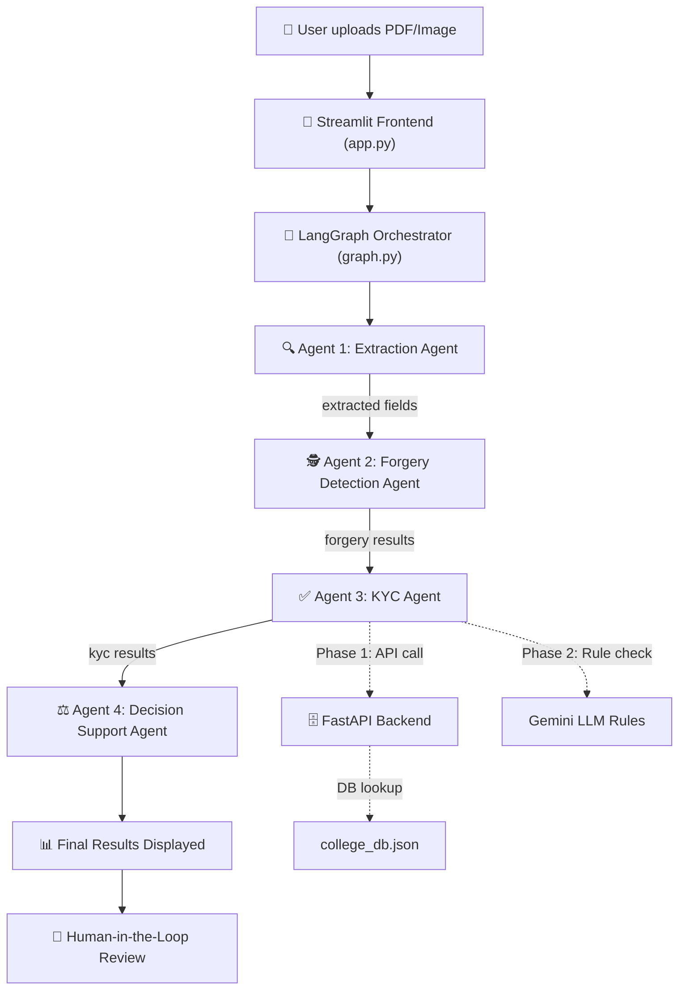

# DocVerify AI — Complete System Flow

> Detailed end-to-end walkthrough of what happens when a user uploads a certificate/PDF for verification.

---

## High-Level Architecture



---

## Stage 0: PDF Upload & Preprocessing (Streamlit Frontend)

**File:** [app.py](file:///D:/Trial/doc_verifier/app.py)

### What happens:
1. User opens the Streamlit app in their browser
2. In the **sidebar**, they enter their Google AI API Key (stored in `os.environ["GOOGLE_API_KEY"]`)
3. They upload one or more files via `st.file_uploader` (supports: `png`, `jpg`, `jpeg`, `pdf`, `bmp`, `tiff`)

### PDF → Image Conversion:
If the uploaded file is a **PDF**, the system:
- Uses **PyMuPDF (`fitz`)** to open the PDF
- Loads only **page 0** (the first page)
- Renders it as a **JPEG image at 150 DPI**
- Converts the JPEG bytes to a **base64-encoded string**

If the uploaded file is already an image, it's directly converted to base64.

### Output stored in session state:
```python
st.session_state.uploaded_docs = {
    "marksheet.pdf": "base64_encoded_image_string..."
}
```

### User selects a document from the sidebar dropdown, then clicks **🚀 Verify Document**.

---

## Stage 1: LangGraph Orchestrator

**File:** [graph.py](file:///D:/Trial/doc_verifier/agents/graph.py)

### What it does:
The orchestrator builds a **LangGraph `StateGraph`** — a directed acyclic graph (DAG) of agent nodes. It defines the fixed pipeline order and manages the shared state that flows between agents.

### Pipeline definition:
```
extraction → [conditional] → forgery_detection → kyc_verification → decision_support → END
```

### Conditional routing:
After extraction, if there's an error or no fields were extracted, the pipeline short-circuits directly to `END` (skipping all downstream agents).

### Initial state created:
```python
initial_state = {
    "document_name": "marksheet.pdf",
    "document_base64": "<base64 string>",
    "document_type": "Unknown",
    "extracted_fields": {},
    "forgery_results": {},
    "kyc_results": {},
    "decision_results": {},
    "final_results": {},
    "overall_verdict": "PENDING",
    "overall_confidence": 0.0,
    "overall_summary": "",
    "human_review_fields": [],
    "human_reviews": {},
    "logs": [<initial orchestrator log>],
    "error": None,
    "current_step": "init",
}
```

### State schema:
**File:** [state.py](file:///D:/Trial/doc_verifier/agents/state.py)

Key types:
- **`FieldResult`**: `{value, status, reason, agent, confidence}` — the per-field output of each agent
- **`LogEntry`**: `{timestamp, agent, action, details, level}` — audit trail entries
- **`logs`** field uses `Annotated[List, operator.add]` — meaning each agent **appends** its logs to the cumulative list (LangGraph's reducer pattern)

---

## Stage 2: Agent 1 — Extraction Agent (OCR)

**File:** [extraction_agent.py](file:///D:/Trial/doc_verifier/agents/extraction_agent.py)

### Purpose:
Extract ALL visible text fields and their values from the document image using Gemini Vision.

### Input:
| Field | Value |
|---|---|
| `document_base64` | The base64-encoded image of the document |
| `document_name` | Filename (e.g. `"marksheet.pdf"`) |

### Processing:
1. Initializes **Gemini 2.5 Flash** (`temperature=0` for deterministic output)
2. Sends a **multimodal message** to Gemini containing:
   - The document image (as `image_url` with base64 data URI)
   - A detailed system prompt asking to extract every visible field
3. The prompt instructs Gemini to return **raw JSON only** — no markdown, no explanation
4. Expected JSON format: `{"field_name": "value", ...}` with clean `snake_case` keys

### System prompt tells Gemini to extract:
- Full Name, Date of Birth, Document/ID Number, Address
- Issue Date, Expiry Date, Issuing Authority
- Document Type (Passport, Aadhaar, PAN, Certificate, Marksheet, etc.)
- Nationality, Gender, and **any other visible fields**

### Post-processing:
- Strips markdown code fences if Gemini wraps the output in ` ```json ` blocks
- Parses JSON via `json.loads()`
- Converts `None` values to empty strings `""`
- Extracts the `document_type` field (e.g. `"Provisional Marksheet"`)

### Output (written back to shared state):
```python
{
    "extracted_fields": {
        "document_type": "Provisional Marksheet",
        "full_name": "CHIKTE ABHAY SANJAY",
        "prn": "12310276",
        "institution_name": "Vishwakarma Institute of Technology, Pune",
        "branch": "Information Technology",
        "program": "BACHELOR OF TECHNOLOGY",
        "semester": "2",
        "cgpa": "9.14",
        "mother_s_name": "SEEMA",
        "address": "666, Upper Indiranagar, Bibwewadi, Pune- 411 037.",
        "issuing_authority": "Controller of Examinations",
        "courses": "[{...}, {...}, ...]",
        # ... all other extracted fields
    },
    "document_type": "Provisional Marksheet",
    "logs": [<extraction logs>],
    "current_step": "extraction_done",
}
```

### Error handling:
- `JSONDecodeError` → sets `error` field, pipeline short-circuits at the conditional edge
- Any other exception → same behavior

---

## Stage 3: Agent 2 — Forgery Detection Agent

**File:** [forgery_agent.py](file:///D:/Trial/doc_verifier/agents/forgery_agent.py)

### Purpose:
Forensically analyze the document image for signs of tampering, digital manipulation, or forgery.

### Input:
| Field | Value |
|---|---|
| `document_base64` | The original document image (same base64) |
| `extracted_fields` | The dict of all fields from the Extraction Agent |

### Processing:
1. Skips entirely if there's a prior `error` or no extracted fields
2. Initializes **Gemini 2.5 Flash** (`temperature=0`)
3. Sends a **multimodal message** with:
   - The document image (base64 data URI)
   - A forensic analysis prompt + the list of extracted fields
4. Gemini acts as a **forensic document analyst** examining:

| Check | What it looks for |
|---|---|
| Digital manipulation | Pixel artifacts, unusual sharpening/blurring around text |
| Font inconsistencies | Mixed fonts, irregular spacing, misaligned text |
| Copy-paste artifacts | Edges around names/numbers suggesting overlaid content |
| Color/ink inconsistencies | Different ink color or printing quality in sections |
| Layout irregularities | Unusual spacing, misaligned fields, broken borders |
| Seal/stamp authenticity | Blurry, pixelated, or digitally inserted stamps |
| Signature authenticity | Signs of tracing or digital insertion |
| Background pattern integrity | Guilloche patterns, watermarks intact |

### Output per field:
```python
forgery_results = {
    "full_name": FieldResult(
        value="CHIKTE ABHAY SANJAY",
        status="verified",     # or "invalid" or "unverifiable"
        reason="Text appears authentic, consistent font and alignment",
        agent="ForgeryDetectionAgent",
        confidence=0.95
    ),
    # ... one entry per extracted field
    "overall_document_integrity": FieldResult(
        value="",
        status="verified",
        reason="Document appears authentic with no signs of tampering",
        agent="ForgeryDetectionAgent",
        confidence=0.92
    ),
}
```

### Status meanings:
- **`verified`** → No signs of tampering detected for this field
- **`invalid`** → Clear signs of forgery or manipulation detected
- **`unverifiable`** → Cannot determine (poor image quality, unusual format)

### Logging:
- Each field flagged as `invalid` gets a `⚠ FRAUD_FLAG` log entry
- Clean fields get a `FIELD_CLEAR` success log

---

## Stage 4: Agent 3 — KYC Agent (Two-Phase Validation)

**File:** [kyc_agent.py](file:///D:/Trial/doc_verifier/agents/kyc_agent.py)

### Purpose:
Validate document fields against **external databases** (Phase 1) and **format/logic rules** (Phase 2).

### Input:
| Field | Value |
|---|---|
| `extracted_fields` | All fields from the Extraction Agent |
| `document_type` | e.g. `"Provisional Marksheet"` |

---

### Phase 1: External API Verification

#### Step 1 — Smart API Routing
**File:** [api_router.py](file:///D:/Trial/doc_verifier/utils/api_router.py)

The API Router uses **Gemini 2.5 Flash** to intelligently decide:
1. **Which API** to call (college_db, aadhaar, pan, passport, or none)
2. **Which fields** are "API-verifiable" (worth checking against a database)
3. **Which fields** are "rule-only" (format/logic checks)
4. **Which fields** are privacy-excluded

For a marksheet, Gemini typically routes to `college_db` and identifies these as API-verifiable:
- `full_name`, `prn`, `institution_name`, `branch`, `program`, `month_year_of_exam`

#### Step 2 — Client Registry Lookup
**File:** [registry.py](file:///D:/Trial/doc_verifier/utils/api_clients/registry.py)

The registry maps document types to API clients:
| Client | Document Types |
|---|---|
| `CollegeAPIClient` | degree certificate, marksheet, transcript, provisional certificate, etc. |
| `AadhaarAPIClient` | aadhaar card |
| `PANAPIClient` | pan card |
| `PassportAPIClient` | passport |

#### Step 3 — College API Client Call
**File:** [college_client.py](file:///D:/Trial/doc_verifier/utils/api_clients/college_client.py)

1. **Normalizes** extracted field names using an alias map:
   - `student_name` → `full_name`
   - `institution` → `college_name`
   - `programme` → `degree`
   - `department` → `branch`
   - etc.

2. Builds a **payload** with only the DB-verifiable fields:
   ```python
   payload = {
       "full_name": "CHIKTE ABHAY SANJAY",
       "prn": "12310276",
       "degree": "BACHELOR OF TECHNOLOGY",
       "branch": "Information Technology",
       "college_name": "Vishwakarma Institute of Technology, Pune"
   }
   ```

3. Sends **HTTP POST** to `http://localhost:8000/api/college/verify-student`

#### Step 4 — Backend Database Lookup
**File:** [college.py](file:///D:/Trial/doc_verifier/backend/routers/college.py)
**Database:** [college_db.json](file:///D:/Trial/doc_verifier/backend/data/college_db.json)

The backend endpoint performs a **weighted matching algorithm**:

| Field | Weight | Match Logic |
|---|---|---|
| `prn` | **3.0** | Exact normalized match (highest — unique identifier) |
| `certificate_number` | **3.0** | Exact normalized match |
| `enrollment_no` | **2.5** | Exact normalized match |
| `roll_number` | **2.0** | Exact normalized match |
| `full_name` | **2.0** | Token-overlap fuzzy match (≥85% = full match, ≥50% = partial) |
| `date_of_birth` | **1.5** | Date normalization and comparison |
| `passing_year` | **1.5** | Exact year match |
| `admission_year` | **1.0** | Exact year match |
| `degree` | **1.0** | Substring containment match |
| `branch` | **1.0** | Substring containment match |

**Confidence** = `sum(matched_weights) / sum(total_weights)`

**Verdict logic:**
- `confidence ≥ 0.75` + no mismatches → **`VALID`**
- `confidence ≥ 0.50` + ≤2 mismatches → **`PARTIAL_MATCH`**
- `confidence < 0.30` → **`NOT_FOUND`**
- Otherwise → **`INVALID`**

> **This is why your fields were marked "Invalid"** — before adding the student to the DB, the PRN `12310276` didn't exist, so the API returned `NOT_FOUND`, which the KYC agent interpreted as "no matching student record found."

#### Step 5 — KYC Agent processes API result

For each API-verifiable field:
- **Matched fields** → status `"verified"`, reason: `"Field matched in College Verification DB API"`
- **Mismatched fields** → status `"invalid"`, reason: `"Field MISMATCH in College Verification DB API"`
- **NOT_FOUND fields** → status `"invalid"`, reason: `"NOT FOUND in College Verification DB API — record does not exist"`

---

### Phase 2: Rule-Based KYC Checks

Fields **not handled by the API** (e.g. `affiliation`, `class`, `semester`, `courses`, `trust_name`, etc.) go through **Gemini-powered rule validation**.

The LLM is given a set of **KYC compliance rules**:

| Rule Category | Validation |
|---|---|
| **Name** | Letters/spaces/dots/hyphens only, 2+ words, 2-100 chars |
| **Dates** | Valid calendar dates; DOB 0-120 years; issue date in past; flag expired |
| **Aadhaar** | 12 digits (spaces OK) |
| **PAN** | Format: `XXXXX0000X` |
| **Passport** | 1 letter + 7 digits |
| **PRN** | 10 digits |
| **Certificate Number** | Alphanumeric with `/-`, 8-30 chars |
| **Address** | 20+ chars, contains locality/city hint |
| **Issuing Authority** | Not blank |

For fields with **no applicable rule** (like `courses`, `affiliation`, `trust_name`), the LLM returns `"unverifiable"` with a reason like *"KYC rules are not defined for this field"*.

> **This is why 9 fields showed as "Unverifiable"** — they passed forgery detection but had no KYC rules or DB records to check against.

### KYC Agent Output:
```python
{
    "kyc_results": {
        "full_name": FieldResult(status="invalid", reason="NOT FOUND in College Verification DB API", confidence=0.0),
        "prn": FieldResult(status="invalid", reason="NOT FOUND in College Verification DB API", confidence=0.0),
        "issuing_authority": FieldResult(status="verified", reason="Not blank, valid authority name [Rule: Issuing authority check]", confidence=1.0),
        "affiliation": FieldResult(status="unverifiable", reason="No KYC rule defined for this field", confidence=0.75),
        # ... etc
    },
    "logs": [<kyc logs>],
    "current_step": "kyc_done",
}
```

---

## Stage 5: Agent 4 — Decision Support Agent

**File:** [decision_agent.py](file:///D:/Trial/doc_verifier/agents/decision_agent.py)

### Purpose:
Aggregate results from both the Forgery Agent and the KYC Agent, resolve conflicts, and produce a **final field-level verdict** and an **overall document decision**.

### Input:
| Field | Value |
|---|---|
| `forgery_results` | Per-field results from the Forgery Agent |
| `kyc_results` | Per-field results from the KYC Agent |
| `extracted_fields` | Original extracted values |
| `document_type` | e.g. `"Provisional Marksheet"` |

### Processing:
1. Merges all field names from both agents into a unified set
2. Builds a **combined summary** per field:
   ```python
   {
       "full_name": {
           "field_value": "CHIKTE ABHAY SANJAY",
           "forgery": {"status": "verified", "reason": "...", "confidence": 0.95},
           "kyc": {"status": "invalid", "reason": "NOT FOUND in DB", "confidence": 0.0}
       },
       # ...
   }
   ```
3. Sends this to **Gemini 2.5 Flash** with decision rules

### Decision Logic (defined in the system prompt):

| Scenario | Final Status |
|---|---|
| **Both agents** say `verified` | → `"verified"` ✅ |
| **Either agent** says `invalid` | → `"invalid"` ❌ |
| One says `unverifiable`, none says `invalid` | → `"unverifiable"` ⚠️ |
| Only one agent checked the field | → Use that agent's result |

### Overall Document Verdict:

| Verdict | Condition |
|---|---|
| **`APPROVED`** ✅ | All critical fields verified, no forgery detected |
| **`REVIEW REQUIRED`** ⚠️ | Some fields unverifiable or minor issues (needs human review) |
| **`REJECTED`** ❌ | Critical fields invalid, forgery detected, or document expired |

### Critical fields (checked with higher priority):
`full_name`, `id_number`, `date_of_birth`, `expiry_date`, `issuing_authority`

### Output:
```python
{
    "final_results": {
        "full_name": FieldResult(
            status="invalid",
            reason="Forgery detection confirmed text authenticity, but KYC failed because no matching record in DB",
            confidence=0.0,
            agent="DecisionSupportAgent"
        ),
        "issuing_authority": FieldResult(
            status="verified",
            reason="Both agents confirmed authenticity and validity",
            confidence=1.0,
            agent="DecisionSupportAgent"
        ),
        # ... one merged entry per field
    },
    "overall_verdict": "REJECTED",        # or "APPROVED" / "REVIEW REQUIRED"
    "overall_confidence": 0.32,
    "overall_summary": "Multiple critical fields could not be verified against the college database...",
    "human_review_fields": ["full_name", "prn", "institution_name", ...],
    "logs": [<decision logs>],
    "current_step": "decision_done",
}
```

---

## Stage 6: Results Display (Streamlit Frontend)

**File:** [app.py](file:///D:/Trial/doc_verifier/app.py)

The final state is stored in `st.session_state.verification_result` and displayed in **3 tabs**:

### Tab 1: 📊 Verification Results
- **Verdict banner** — color-coded (green/amber/red) with overall confidence
- **Stats row** — counts of Verified / Invalid / Unverifiable / Human Reviewed
- **Field-by-field table** — each field shown with:
  - Status badge (color-coded)
  - Field name, extracted value
  - Reason/finding from the Decision Agent
  - Confidence percentage
- Fields sorted by status: verified → human_approved → unverifiable → invalid → human_rejected

### Tab 2: 🔍 Logs & Audit Trail
- Complete chronological audit log of every action by every agent
- Filterable by level (SUCCESS / WARNING / ERROR / INFO)
- Downloadable as **CSV** or **full JSON report**
- Includes human review decisions if any

### Tab 3: 👤 Human Review
- Lists all fields marked `invalid` or `unverifiable`
- For each field, shows:
  - The extracted value and the agent's finding
  - An expandable document image preview
  - A text area for review notes
  - **Approve ✅** / **Reject ❌** buttons
- Decisions are logged with reviewer name, timestamp, and notes

---

## Complete Data Flow Summary

```mermaid
flowchart LR
    subgraph Frontend
        A["PDF Upload"] --> B["PyMuPDF: PDF→JPEG"]
        B --> C["Base64 Encode"]
    end

    subgraph Orchestrator
        C --> D["Initial State Created"]
        D --> E["LangGraph invoke()"]
    end

    subgraph Agent1["🔍 Extraction Agent"]
        E --> F["Gemini 2.5 Flash Vision"]
        F --> G["JSON Parse → extracted_fields"]
    end

    subgraph Agent2["🕵️ Forgery Agent"]
        G --> H["Gemini 2.5 Flash Vision"]
        H --> I["Per-field forgery_results"]
    end

    subgraph Agent3["✅ KYC Agent"]
        G --> J["Phase 1: API Router"]
        J --> K["Gemini routes to college_db"]
        K --> L["CollegeAPIClient.verify()"]
        L --> M["POST /api/college/verify-student"]
        M --> N["Weighted DB Match"]
        N --> O["API results → kyc_results"]
        G --> P["Phase 2: Rule Engine"]
        P --> Q["Gemini validates format/logic"]
        Q --> O
    end

    subgraph Agent4["⚖️ Decision Agent"]
        I --> R["Merge forgery + KYC"]
        O --> R
        R --> S["Gemini produces final verdict"]
        S --> T["final_results + overall_verdict"]
    end

    subgraph Display
        T --> U["Streamlit 3-Tab UI"]
        U --> V["Human Review Loop"]
    end
```



---

## Summary: What Each Agent Checks

| Agent | What it Checks | How | Model Used |
|---|---|---|---|
| **Extraction Agent** | All visible text on the document | Gemini Vision OCR on the image | Gemini 2.5 Flash |
| **Forgery Agent** | Visual authenticity of each field area | Gemini Vision forensic analysis on the image | Gemini 2.5 Flash |
| **KYC Agent (Phase 1)** | Identity fields against external database | HTTP API call to FastAPI backend → JSON DB lookup | None (HTTP) |
| **KYC Agent (Phase 2)** | Format/logic rules (name pattern, date validity, ID format) | Gemini as a rule engine | Gemini 2.5 Flash |
| **Decision Agent** | Conflict resolution between Forgery + KYC | Gemini as a decision engine | Gemini 2.5 Flash |

---

## Primary Schema: What the College DB Checks

The **primary fields** the KYC agent sends to the College DB API for verification (the fields that prove a document is genuine):

| Priority | Field | Weight | Why it matters |
|---|---|---|---|
| 🔴 Critical | `prn` | 3.0 | Unique student identifier — strongest proof |
| 🔴 Critical | `certificate_number` | 3.0 | Unique document identifier |
| 🟠 High | `enrollment_no` | 2.5 | Institutional enrollment ID |
| 🟠 High | `full_name` | 2.0 | Identity verification (fuzzy matched) |
| 🟠 High | `roll_number` | 2.0 | Class-specific identifier |
| 🟡 Medium | `date_of_birth` | 1.5 | Personal identity cross-check |
| 🟡 Medium | `passing_year` | 1.5 | Academic timeline verification |
| 🔵 Supporting | `admission_year` | 1.0 | Timeline consistency |
| 🔵 Supporting | `degree` | 1.0 | Program verification |
| 🔵 Supporting | `branch` | 1.0 | Department verification |
| 🔵 Supporting | `college_name` | — | Used to filter candidates (not scored directly) |

**All other fields** (courses, CGPA, semester, trust name, affiliation, etc.) are **not checked against the DB** — they go through the rule-based KYC engine or remain unverifiable.
